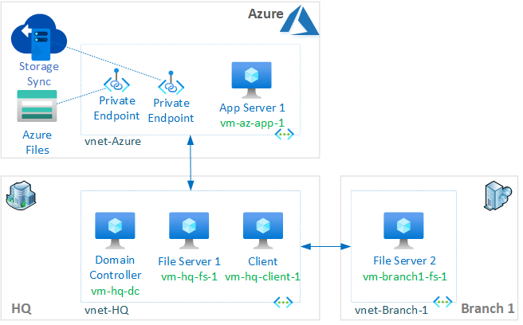

# Challenge 0: Environment Setup

**[Home](../README.md)** - [Next Challenge >](./Challenge-01-set_files_and_filesync.md)

## Description

Environment that will be beployed in this challenge is required before starting with next challenges. It will be deployed in series of VMs in Azure with configurations that include Active Directory Domain and File Server(s) so it takes a while to deploy and configure (estimate 30 min).

Environment is deployed by executing deployment of provided Bicep templates. Configurations are done by using provided PowerShell DSC configurations. Templates will deploy the following components across 3 different Azure regions:
- On-prem (HQ - North Europe and Branch Site - UK South):
    - HQ Domain Controller - contoso.com (vm-hq-dc)
    - HQ File Server (vm-hq-fs-1)
    - Client Machine (vm-hq-client-1)
    - Branch File Server (vm-branch1-fs-1)
- Azure (Hub - West Europe)
    - Virtual Network (vnet-azhub)
    - Azure App VM (vm-az-app-1)
- Azure Bastion to access environment
- VNet peering is used for simplified connectivity between HQ and Branch, HQ and Azure Hub.

## Deploy environment template using templates

Steps to deploy Azure Files environment:

1. Download required templates and extract them into local Folder using following [link](https://minhaskamal.github.io/DownGit/#/home?url=https://github.com/akasnik/WhatTheHack/tree/master/046-AzureFiles/Student/Resources).
1. Login to your Azure subscription using PowerShell or Azure CLI.
    - AZ CLI: az login
    - PowerShell: Connect-AzAccount
        - az account set --subscription "Subscription Name"
1. Create a resource group in Azure where environment will be deployed.
    - AZ CLI: az group create -n 'rg-lab-afs' -l 'westeurope'
    - PowerShell: New-AzResourceGroup -Name 'rg-lab-afs' -Location 'westeurope'
1. (Optional) Modify parameter values within ".\bicep\azfiles-lab.parameters.json" file if required.
1. Initiate template deployment.
    - Switch to the .\bicep\ folder. 
    - AZ CLI:  az deployment group create -g 'rg-lab-afs' -f .\azfiles-lab.json --parameters .\azfiles-lab.parameters.json
    - Powershell: New-AzResourceGroupDeployment -Name AzFilesLab -ResourceGroupName 'rg-lab-afs' -TemplateFile .\azfiles-lab.json -TemplateParameterFile .\azfiles-lab.parameters.json
1. Type password to be used for all accounts (including domain admin) in your lab environment. Be sure to remember that password as you will need it to log into the environment.
1. Wait for deployment to finish, it should take around 30 minutes for deployment to finish.

Some useful reading while your environment is deploying that will help you with next challenges:
- [Planning for an Azure Files deployment](https://docs.microsoft.com/azure/storage/files/storage-files-planning)
- [Planning for an Azure File Sync deployment](https://docs.microsoft.com/azure/storage/file-sync/file-sync-planning)
- [Create an Azure file share](https://docs.microsoft.com/azure/storage/files/storage-how-to-create-file-share)
- [Deploy Azure File Sync](https://docs.microsoft.com/azure/storage/file-sync/file-sync-deployment-guide)

## Validate deployment
Steps to check connectivity and validate whether DSC has completed the required configurations for the base environment to start with next challenges below.

1. Connect to all VMs using Bastion.  
*Note: if you haven't changed deployment parameters, default administrator username will be 'azadmin'; use the password that you entered as parameter at the start of deployment; default domain name is 'contoso.com')*
1. Validate Domain Controller, check Computers OU objects - make sure all machines are domain joined.
1. Connect to HQ File Server, validate F:\Share1 exist with some dummy folder and files.
1. Connect to HQ-Client-1, open elevated command prompt or powershell and run below command to map the file share to a local M: drive on the VM.
    - net use M: \\vm-hq-fs-1\Share1 /persistent:Yes
1. Edge browser is deployed on servers for internet access/file downloads.

## Learning resources
- [How to deploy resources with Bicep and Azure CLI](https://docs.microsoft.com/en-us/azure/azure-resource-manager/bicep/deploy-cli)
- [Deploy resources with Bicep and Azure PowerShell](https://docs.microsoft.com/en-us/azure/azure-resource-manager/bicep/deploy-powershell)